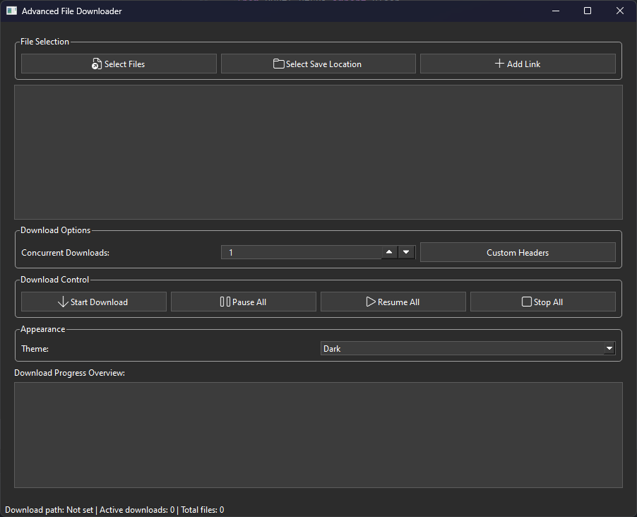
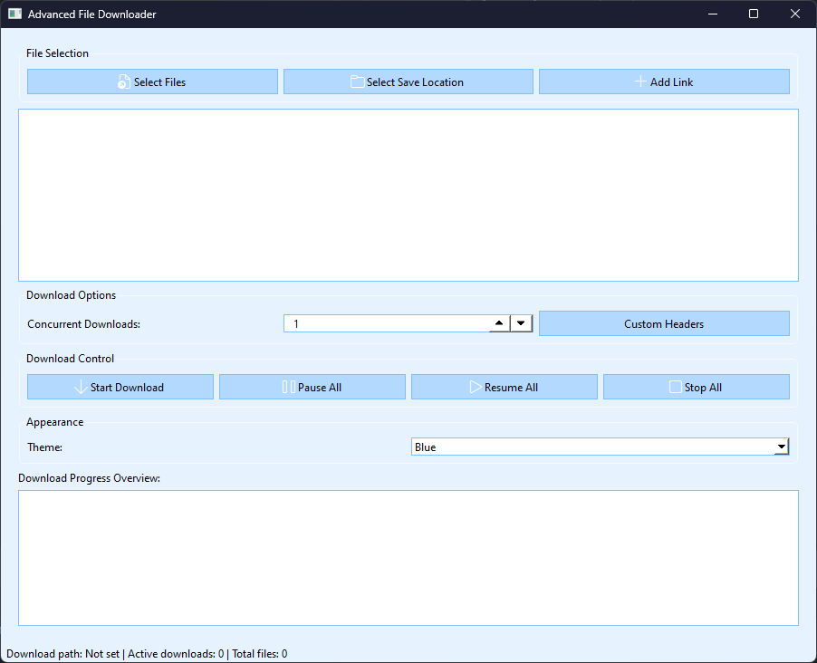

# Advanced File Downloader

A PyQt6-based GUI application for managing and executing multiple file downloads concurrently thanks to: [mjishnu/pypdl](https://github.com/mjishnu/pypdl).
## Features

- Select multiple files containing download links
- Choose download save location
- Add individual download links manually
- Set custom HTTP headers for downloads
- Manage concurrent downloads with adjustable limits
- Pause, resume, and stop all active downloads
- Theme selection (Light, Dark, Blue)
- Download progress overview
- Persistent settings across sessions

## Dependencies

- Python 3.x
- PyQt6
- pypdl

## Screenshots
### DAKR THEME

### BLUE THEME

## Main Components

### DownloaderApp

The main application window, handling the overall UI and download management.

Key methods:
- `setup_ui()`: Sets up the main user interface
- `start_download()`: Initiates the download process for selected files
- `pause_all_downloads()`, `resume_all_downloads()`, `stop_all_downloads()`: Manage active downloads
- `change_theme()`: Applies different color themes to the UI
- `load_settings()`, `save_settings()`: Handle persistent application settings

### DownloadWindow

A separate window for each active download, showing individual progress.

Key methods:
- `update_progress()`: Updates the progress bar and download speed
- `toggle_pause_resume()`: Toggles between pausing and resuming the download
- `download_finished()`: Handles the completion of a download

### DownloadThread

A QThread subclass that manages the actual download process using the `Pypdl` library.

Key methods:
- `run()`: Executes the download process
- `pause()`, `resume()`: Control the download state

## Usage

1. Run the script to launch the application.
2. Select files containing download links or add links manually.
3. Choose a save location for downloads.
4. Set the number of concurrent downloads allowed.
5. Optionally set custom headers for the downloads.
6. Start the download process.
7. Monitor progress in the main window and individual download windows.
8. Use pause, resume, and stop controls as needed.

## Customization

- Modify the `change_theme()` method in `DownloaderApp` to add or adjust themes.
- Extend the `HeaderDialog` to include additional HTTP headers if required.

## Note

This application uses QSettings to save user preferences and download states between sessions.

---

To use this application, ensure all dependencies are installed and run the script. The GUI will provide intuitive controls for managing your downloads.